<p align="center">
  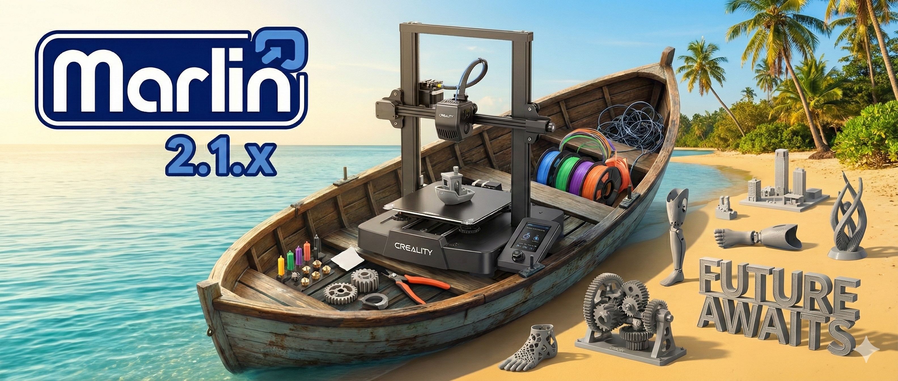
</p>

<p align="center">
  <a href="https://github.com/navaismo/Marlin_bugfix_2.1_E3V3SE">
    
  </a>
  
  
</p>

This version of Firmware uses the Marlin Bugfix 2.1.x Branch to bring all the goodies of the updated version into the Ender 3 V3 SE.

I have ported many of the features and fixes from the community stock version in the old repo: https://github.com/navaismo/Ender-3V3-SE. It may look we have the same but at the core is different.

## Table of Contents
- [Modular](#modular)
- [Which Branch to choose](#which-branch-to-choose)
- [Installation](#installation)
- [Features](#features)
  - [Thumbnail](#-thumbnail)
  - [ONE CLICK PRINT](#-one-click-print)
  - [Enhanced Z Offset Calculation](#-enhanced-z-offset-calculation)
    - [X Routine](#x-routine)
    - [Delta Routine](#delta-routine)
  - [Leveling Menu](#-leveling-menu)
  - [Skew Correction Menu](#-skew-correction-menu)
- [Ported Features](#ported-features)
  - [Input Shaping](#-input-shaping)
  - [LCD Dimm & Brightness Menu](#-lcd-dimm--brightness-menu)
  - [Mute Buzzer](#-mute-buzzer)
  - [CRTouch Test Functions](#-crtouch-test-functions)
  - [Z Height after Homing](#-z-height-after-homing)
  - [Extra Preheat Labels](#-extra-preheat-labels)
  - [Custom Extrude Menu](#-custom-extrude-menu)
  - [Linear Advance](#-linear-advance)
  - [Increased Temperature for BED and Noozle](#-increased-temperature-for-bed-and-noozle)
- [Explore New Features](#explore-new-features)


## Modular

<div align="left"  >

  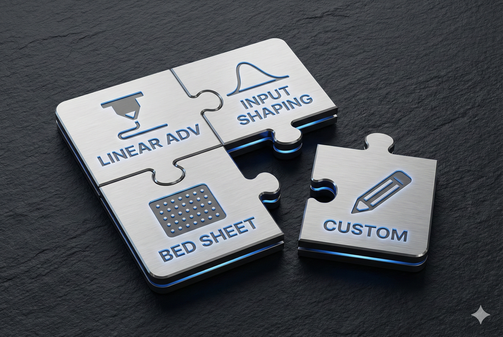

</div>  

<br>

From now on the Firmware will be modular, meaning that you must choose which components want to have considering the limit of the memory which must be RAM less than 40% and Flash less than 46%.


## Which branch to choose

<table border="1" cellspacing="0" cellpadding="10" width="100%">
  <thead>
    <tr>
      <th align="center" width="50%">Board CR4NS200320C13 (HW C13)</th>
      <th align="center" width="50%">Board CR4NS200320C14 (HW C14)</th>
    </tr>
  </thead>

  <tbody>
    <tr>
      <td valign="top">

#### ONLY SD CARD

- [**for_E3V3SE**](https://github.com/navaismo/Marlin_bugfix_2.1_E3V3SE/tree/for_E3V3SE)
  - Release tag: [krasnaya_3](https://github.com/navaismo/Marlin_bugfix_2.1_E3V3SE/releases/tag/krasnaya_3)

- The Binary provided will contain just the following features:

  * [D ROUTINE AUTO Z OFFSET](#delta-routine).
  * [DWIN RENDER THUMBNAIL](#-thumbnail).
  * [ONE CLICK PRINT](#-one-click-print)
  * [INPUT SHAPING](#-input-shaping).
  * [LINEAR ADVANCE](#-linear-advance).
  * [Mcodes for LCD Dimm & Brightness](#-lcd-dimm-&-brightness-menu).
  * [Mute or Unmute Buzzer](#-mute-buzzer).
  * [CRTouch test functions](#-crtouch-test-functions).

  With a Memory cost of:

``` c++
Advanced Memory Usage is available via "PlatformIO Home > Project Inspect"
RAM:   [===       ]  31.7% (used 20788 bytes from 65536 bytes)
Flash: [====      ]  44.8% (used 221924 bytes from 495616 bytes)
``` 

  </td>
  <td valign="top">

#### ONLY SD CARD

- [**for_STM32F401**](https://github.com/navaismo/Marlin_bugfix_2.1_E3V3SE/tree/for_STM32F401)
  - Release tag: [krasnaya_3_F401](https://github.com/navaismo/Marlin_bugfix_2.1_E3V3SE/releases/tag/Krasnaya_3_F401)

- The Binary provided will contain just the following features:

  * [D ROUTINE AUTO Z OFFSET](#delta-routine).
  * [DWIN RENDER THUMBNAIL](#-thumbnail).
  * [ONE CLICK PRINT](#-one-click-print)
  * [INPUT SHAPING](#-input-shaping).
  * [LINEAR ADVANCE](#-linear-advance).
  * [Mcodes for LCD Dimm & Brightness](#-lcd-dimm-&-brightness-menu).
  * [Mute or Unmute Buzzer](#-mute-buzzer).
  * [CRTouch test functions](#-crtouch-test-functions).

  With a Memory cost of:

``` c++
Advanced Memory Usage is available via "PlatformIO Home > Project Inspect"
RAM:   [===       ]  31.3% (used 20540 bytes from 65536 bytes)
Flash: [====      ]  42.8% (used 220244 bytes from 514288 bytes)
``` 


  <tr>
  <td valign="top">

#### OctoPrint (or Serial Host)

- [**for_Octoprint**](https://github.com/navaismo/Marlin_bugfix_2.1_E3V3SE/tree/for_Octoprint)
  - Release tag: [Belaya_2](https://github.com/navaismo/Marlin_bugfix_2.1_E3V3SE/releases/tag/Belaya_2)

- The Binary provided will contain just the following features:

  * [D ROUTINE AUTO Z OFFSET](#delta-routine).
  * [DWIN RENDER THUMBNAIL](#-thumbnail).
  * [ONE CLICK PRINT](#-one-click-print)
  * [FT_MOTION](#-ft_motion).
  * [MeatPack Enabled](https://plugins.octoprint.org/plugins/meatpack/).
  * [LINEAR ADVANCE](#-linear-advance).
  * [Mcodes for LCD Dimm & Brightness](#-lcd-dimm-&-brightness-menu).
  * [Mute or Unmute Buzzer](#-mute-buzzer).
  * [CRTouch test functions](#-crtouch-test-functions).
  * Baud rate of 115200.

With a Memory cost of:

``` c++
Advanced Memory Usage is available via "PlatformIO Home > Project Inspect"
RAM:   [===       ]  31.8% (used 20856 bytes from 65536 bytes)
Flash: [=====     ]  47.9% (used 237512 bytes from 495616 bytes)
``` 


  </td>
  <td valign="top">

#### OctoPrint (or Serial Host)

- [**for_Octoprint_F401**](https://github.com/navaismo/Marlin_bugfix_2.1_E3V3SE/tree/for_Octoprint_F401)
  - Release tag: [Belaya_2_F401](https://github.com/navaismo/Marlin_bugfix_2.1_E3V3SE/releases/tag/Belaya_2_F401)

- The Binary provided will contain just the following features:

  * [D ROUTINE AUTO Z OFFSET](#delta-routine).
  * [DWIN RENDER THUMBNAIL](#-thumbnail).
  * [ONE CLICK PRINT](#-one-click-print)
  * [FT_MOTION](#-ft_motion).
  * [MeatPack Enabled](https://plugins.octoprint.org/plugins/meatpack/).
  * [LINEAR ADVANCE](#-linear-advance).
  * [Mcodes for LCD Dimm & Brightness](#-lcd-dimm-&-brightness-menu).
  * [Mute or Unmute Buzzer](#-mute-buzzer).
  * [CRTouch test functions](#-crtouch-test-functions).
  * Baud rate of 115200.

With a Memory cost of:

``` c++
Advanced Memory Usage is available via "PlatformIO Home > Project Inspect"
RAM:   [===       ]  31.4% (used 20604 bytes from 65536 bytes)
Flash: [=====     ]  45.6% (used 234484 bytes from 514288 bytes)
``` 


  </td>
  </tr>
  </tbody>
</table>


## Installation

> [!TIP]
> 
> Follow the [Wiki Article to Flash Firmware](https://github.com/navaismo/Marlin_bugfix_2.1_E3V3SE/wiki/Flashing-your-Printer).
>

It is recommended to create your own Binary with your desired features, using either the configuration files, the Marlin autobuild VSCode extension or Follow the [Wiki Article to compile the firmware using Github Actions](https://github.com/navaismo/Marlin_bugfix_2.1_E3V3SE/wiki/Compiling-the-Firmware-using-Github-Actions).

> [!IMPORTANT]
> 
> For this version is important that you check the e-Steps of your extruder before start a print job.
> in my case old firmware had **424.9** as value for a normal extrusion but for Marlin 2.1 needed to adjust to **715.12**
>
> So please calibrate it after the Z offset calculation finished.


## Features

### * Thumbnail

<div align="left" >

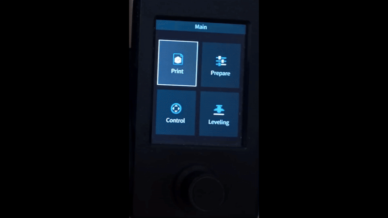


</div>  

A new feature is available to Render the Thumbnail of the Gcode file, this time you dont need Octoprint it can be donde from the SD, but you need patience.
```c++
#define DWIN_RENDER_THUMBNAIL  // Enable the Rendering of the Thumbnail Image from Gcode Script for E3V3SE

```

> [!TIP]
> 
> Follow the [Wiki Article to enable the Thumbnail](https://github.com/navaismo/Marlin_bugfix_2.1_E3V3SE/wiki/OrcaSlicer-Thumbnail-Setup).
>

<br>

### * One Click Print

<div align="left" >


</div>  

A new feature is available, when you insert the SD Card automatically will search the latest file and ask if you want to print it now!
```c++
#define ONE_CLICK_PRINT  // Prompt to print the newest file on inserted media

```

<br>

### * Enhanced Z Offset Calculation.

For this version you can Enable 2 routines to calculate the Z offset based on 5 or 4 points of the BED.

#### X Routine

<div align="left" >

  

</div>  

Enable in configuration.h
```c++
#define X_ROUTINE_AUTO_OFFSET  // Enable this to calculate the Z offset automatically using the 5 points of the bed, (X) pattern
```

#### Delta Routine

<div align="left" >

  

</div>  

Enable in configuration.h
```c++
#define D_ROUTINE_AUTO_OFFSET  // Enable this to calculate the Z offset automatically using the 4 points of the bed, (Delta) pattern
```

> [!TIP]
> 
> Follow the [Wiki Article to set your Z offset](https://github.com/navaismo/Marlin_bugfix_2.1_E3V3SE/wiki/Z-offset/)
>

<br>

### * Leveling Menu

<div align="left" >

  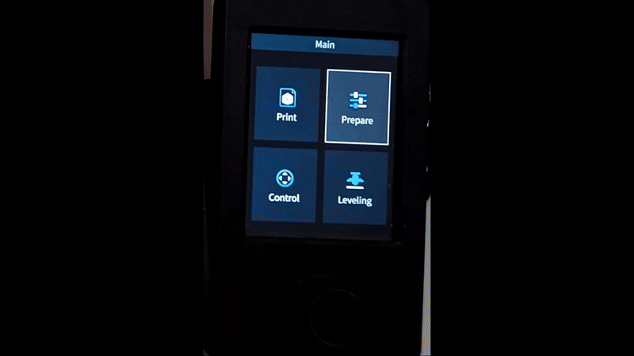

</div>  

We have splitted the Leveling features to avoid a complete reset like routine. Now you can Level the bed, get the offset and edit the point individually.

<br>

### * Skew Correction Menu

<div align="left" >

  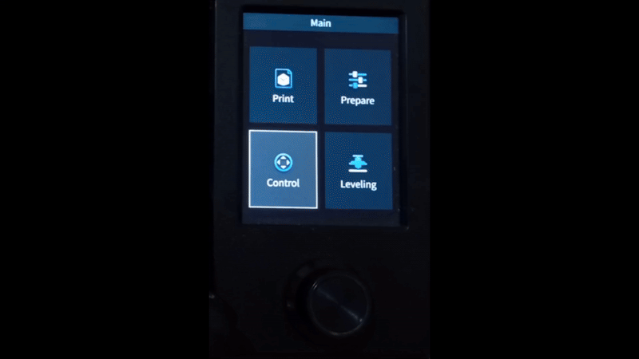

</div> 

We have created a Menu to set and calculate the bed Skew of your printer.

> [!TIP]
> 
> Follow the [Wiki Article to set the Skew Factor](https://github.com/navaismo/Marlin_bugfix_2.1_E3V3SE/wiki/Fixing-Skew)
>


## Ported Features.


### * Compact 6x6 GRID
<div align="left" >

  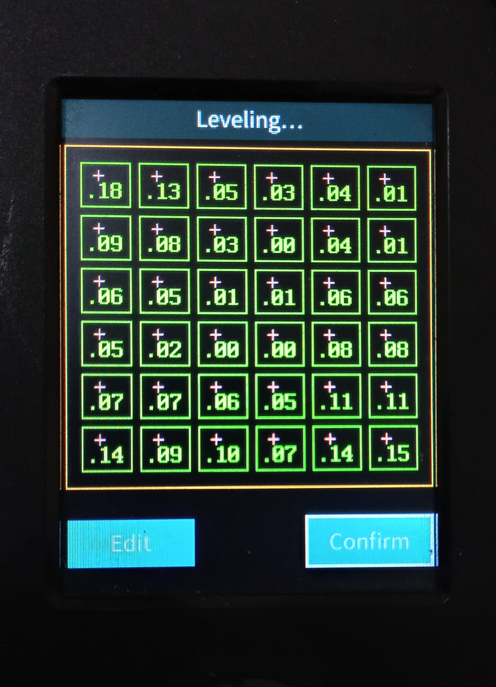

</div> 

### * Input Shaping.

<div align="left" >

  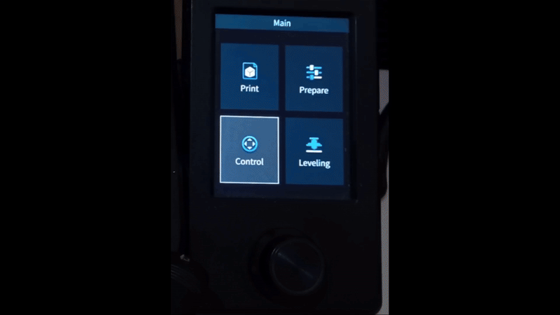

</div> 

Enable in configuration.h
```c++
#define INPUT_SHAPING_X
#define INPUT_SHAPING_Y
```

To Enable the Display Menu

```c++
#define DWIN_INPUT_SHAPING_MENU        // Enable LCD Menu to Configure Input Shaping parameters
```

> [!TIP]
> 
> Follow the [Wiki Article to understand Input Shaping](https://github.com/navaismo/Marlin_bugfix_2.1_E3V3SE/wiki/Input-Shaping)
>


<br>

### * LCD Dimm & Brightness Menu.

<div align="left" >

  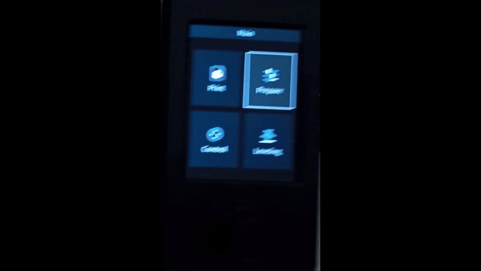

</div> 

Enable in configuration.h
```c++
#define DWIN_DIMM_MENU                    // Enable LCD Menu to Configure Brightness & DIMM parameters
```

If you don't enable you can use the Mcodes M255 & 256

<br>


### * Mute Buzzer.

<div align="left" >

  

</div> 

This feature is enabled by default.

<br>

### * CRTouch test functions.

<div align="left" >

  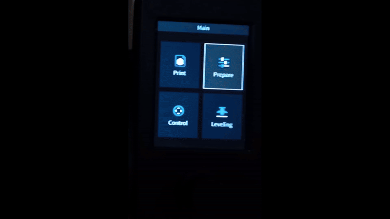

</div> 

This feature is enabled by default.

<br>

### * Z Height after Homing.

<div align="left" >

  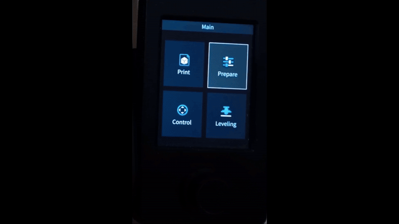

</div> 

Enable in configuration.h

```c++
#define DWIN_ZHOME_MENU             // Enable LCD Menu to Configure Z Height after Homing
```
<br>

### * Extra Preheat Labels.

<div align="left" >

  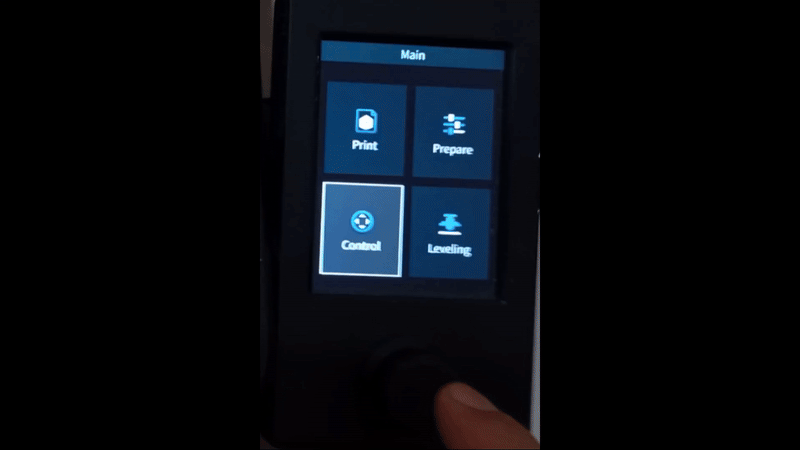

</div> 

Enable in configuration.h

```c++
#define EXTRA_PREHEAT_LABELS    // Enable LCD Menu to Configure 2 Extra Preheat Materials
```

<br>

### * Custom Extrude Menu.

<div align="left" >

  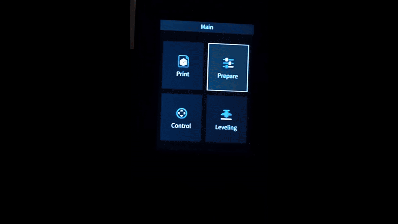

</div> 

Enable in configuration.h

```c++
#define DWIN_CUSTOM_EXTRUDE     // Enable LCD Menu for Custom Extrude Functions
```

<br>

### * Linear Advance.

Enable by default in Configuration_adv.h
```c++
#define LIN_ADVANCE
``` 

> [!TIP]
> 
> Follow the [Wiki Article to understand Linear Advance.](https://github.com/navaismo/Marlin_bugfix_2.1_E3V3SE/wiki/Linear-Advance)
>


### * Increased Temperature for BED and Noozle.

* **BED 120°C**
* **Nozzle 300°C**

> [!CAUTION]
> 
> Beware of the ptfe tube that present deformation starting at 250°C degrees, for Higher temps replace the noozle for the unicorn.
>


<br>

## Explore new features.

You can explore the new features on the Marlin 2.1 like:

### * **FT_MOTION** Which enables different filters of Shapers for the machine, like Klipper does. 
```c++
#define FT_MOTION
#if ENABLED(FT_MOTION)
  #define FTM_IS_DEFAULT_MOTION               // Use FT Motion as the factory default?
  //#define FT_MOTION_MENU                      // Provide a MarlinUI menu to set M493 and M494 parameters
  //#define FTM_HOME_AND_PROBE                  // Use FT Motion for homing / probing. Disable if FT Motion breaks these functions.

  #define FTM_DEFAULT_DYNFREQ_MODE dynFreqMode_DISABLED // Default mode of dynamic frequency calculation. (DISABLED, Z_BASED, MASS_BASED)

  #define FTM_DEFAULT_SHAPER_X      ftMotionShaper_3HEI // Default shaper mode on X axis (NONE, ZV, ZVD, ZVDD, ZVDDD, EI, 2HEI, 3HEI, MZV)
  #define FTM_SHAPING_DEFAULT_FREQ_X   40.0f    // (Hz) Default peak frequency used by input shapers
  #define FTM_SHAPING_ZETA_X            0.1f    // Zeta used by input shapers for X axis
  #define FTM_SHAPING_V_TOL_X           0.05f   // Vibration tolerance used by EI input shapers for X axis

  #define FTM_DEFAULT_SHAPER_Y      ftMotionShaper_3HEI // Default shaper mode on Y axis
  #define FTM_SHAPING_DEFAULT_FREQ_Y   42.0f    // (Hz) Default peak frequency used by input shapers
  #define FTM_SHAPING_ZETA_Y            0.1f    // Zeta used by input shapers for Y axis
  #define FTM_SHAPING_V_TOL_Y           0.05f   // Vibration tolerance used by EI input shapers for Y axis

  //#define FTM_SHAPER_Z                        // Include Z shaping support
  #define FTM_DEFAULT_SHAPER_Z      ftMotionShaper_NONE // Default shaper mode on Z axis
  #define FTM_SHAPING_DEFAULT_FREQ_Z   21.0f    // (Hz) Default peak frequency used by input shapers
  #define FTM_SHAPING_ZETA_Z            0.03f   // Zeta used by input shapers for Z axis
  #define FTM_SHAPING_V_TOL_Z           0.05f   // Vibration tolerance used by EI input shapers for Z axis

  //#define FTM_SHAPER_E                        // Include E shaping support
                                                // Required to synchronize extruder with XYZ (better quality)
  #define FTM_DEFAULT_SHAPER_E      ftMotionShaper_NONE // Default shaper mode on Extruder axis
  #define FTM_SHAPING_DEFAULT_FREQ_E   21.0f    // (Hz) Default peak frequency used by input shapers
  #define FTM_SHAPING_ZETA_E            0.03f   // Zeta used by input shapers for E axis
  #define FTM_SHAPING_V_TOL_E           0.05f   // Vibration tolerance used by EI input shapers for E axis

  #define FTM_SMOOTHING                       // Smoothing can reduce artifacts and make steppers quieter
                                                // on sharp corners, but too much will round corners.
  #if ENABLED(FTM_SMOOTHING)
    #define FTM_MAX_SMOOTHING_TIME      0.10f   // (s) Maximum smoothing time. Higher values consume more RAM.
                                                // Increase smoothing time to reduce jerky motion, ghosting and noises.
    #define FTM_SMOOTHING_TIME_X        0.00f   // (s) Smoothing time for X axis. Zero means disabled.
    #define FTM_SMOOTHING_TIME_Y        0.00f   // (s) Smoothing time for Y axis
    #define FTM_SMOOTHING_TIME_Z        0.00f   // (s) Smoothing time for Z axis
    #define FTM_SMOOTHING_TIME_E        0.02f   // (s) Smoothing time for E axis. Prevents noise/skipping from LA by
                                                //     smoothing acceleration peaks, which may also smooth curved surfaces.
  #endif

  #define FTM_TRAJECTORY_TYPE   TRAPEZOIDAL // Block acceleration profile (TRAPEZOIDAL, POLY5, POLY6)
                                            // TRAPEZOIDAL: Continuous Velocity. Max acceleration is respected.
                                            // POLY5:       Like POLY6 with 1.5x but uses less CPU.
                                            // POLY6:       Continuous Acceleration (aka S_CURVE).
                                            // POLY trajectories not only reduce resonances without rounding corners, but also
                                            // reduce extruder strain due to linear advance.

  #define FTM_POLY6_ACCELERATION_OVERSHOOT 1.875f // Max acceleration overshoot factor for POLY6 (1.25 to 1.875)

  /**
   * Advanced configuration
   */
  #define FTM_BUFFER_SIZE             128   // Window size for trajectory generation, must be a power of 2 (e.g 64, 128, 256, ...)
                                            // The total buffered time in seconds is (FTM_BUFFER_SIZE/FTM_FS)
  #define FTM_FS                     1000   // (Hz) Frequency for trajectory generation.
  #define FTM_STEPPER_FS        2'000'000   // (Hz) Time resolution of stepper I/O update. Shouldn't affect CPU much (slower board testing needed)
  #define FTM_MIN_SHAPE_FREQ           20   // (Hz) Minimum shaping frequency, lower consumes more RAM

#endif // FT_MOTION
``` 


> [!TIP]
> 
> Check the [Octoprint Pinput-Shaping plugin](https://github.com/navaismo/Octoprint-Pinput_Shaping) to get the frequencies.
>
> Check the [comparison between Marlin & Klipper Input Shaping](https://github.com/navaismo/Octoprint-Pinput_Shaping/discussions/27).
>

<br>

### * **AXIS TWIST COMPENSATION** 
```c++
 // Add calibration in the Probe Offsets menu to compensate for X-axis twist.
    #define X_AXIS_TWIST_COMPENSATION
    #if ENABLED(X_AXIS_TWIST_COMPENSATION)
      /**
       * Enable to init the Probe Z-Offset when starting the Wizard.
       * Use a height slightly above the estimated nozzle-to-probe Z offset.
       * For example, with an offset of -5, consider a starting height of -4.
       */
      #define XATC_START_Z 0.0
      #define XATC_MAX_POINTS 3             // Number of points to probe in the wizard
      #define XATC_Y_POSITION Y_CENTER      // (mm) Y position to probe
      #define XATC_Z_OFFSETS { 0, 0, 0 }    // Z offsets for X axis sample points
    #endif
```    


### * Marlin 2.1.x is also compatible with the [CacomixtlePad for Android](https://github.com/navaismo/cacomixtlePad)


And so on...


<br>
<br>
<hr>
<br>
<p align="center"></p>

<h1 align="center">Marlin 3D Printer Firmware</h1>

<p align="center">
    <a href="/LICENSE"></a>
    <a href="//github.com/MarlinFirmware/Marlin/graphs/contributors"></a>
    <a href="//github.com/MarlinFirmware/Marlin/releases"></a>
    <a href="//github.com/MarlinFirmware/Marlin/actions/workflows/ci-build-tests.yml"></a>
    <a href="//github.com/sponsors/thinkyhead"></a>
    <br />
    <a href="//bsky.app/profile/marlinfw.org"></a>
    <a href="//fosstodon.org/@marlinfirmware"></a>
</p>

### 🌍 Translations

<table>
<tr>
  <td><a href="//translate.google.com/translate?u=github.com/MarlinFirmware/Marlin&sl=auto&tl=an">Aragonés</a></td>
  <td><a href="//translate.google.com/translate?u=github.com/MarlinFirmware/Marlin&sl=auto&tl=bg">Български</a></td>
  <td><a href="//translate.google.com/translate?u=github.com/MarlinFirmware/Marlin&sl=auto&tl=ca">Català</a></td>
  <td><a href="//translate.google.com/translate?u=github.com/MarlinFirmware/Marlin&sl=auto&tl=cs">Čeština</a></td>
  <td><a href="//translate.google.com/translate?u=github.com/MarlinFirmware/Marlin&sl=auto&tl=da">Dansk</a></td>
  <td><a href="//translate.google.com/translate?u=github.com/MarlinFirmware/Marlin&sl=auto&tl=de">Deutsch</a></td>
  <td><a href="//translate.google.com/translate?u=github.com/MarlinFirmware/Marlin&sl=auto&tl=el">Ελληνικά</a></td>
</tr>
<tr>
  <td><a href="//github.com/MarlinFirmware/Marlin">English</a></td>
  <td><a href="//translate.google.com/translate?u=github.com/MarlinFirmware/Marlin&sl=auto&tl=es">Español</a></td>
  <td><a href="//translate.google.com/translate?u=github.com/MarlinFirmware/Marlin&sl=auto&tl=eu">Euskara</a></td>
  <td><a href="//translate.google.com/translate?u=github.com/MarlinFirmware/Marlin&sl=auto&tl=fi">Suomi</a></td>
  <td><a href="//translate.google.com/translate?u=github.com/MarlinFirmware/Marlin&sl=auto&tl=fr">Français</a></td>
  <td><a href="//translate.google.com/translate?u=github.com/MarlinFirmware/Marlin&sl=auto&tl=gl">Galego</a></td>
  <td><a href="//translate.google.com/translate?u=github.com/MarlinFirmware/Marlin&sl=auto&tl=hr">Hrvatski</a></td>
</tr>
<tr>
  <td><a href="//translate.google.com/translate?u=github.com/MarlinFirmware/Marlin&sl=auto&tl=hu">Magyar</a></td>
  <td><a href="//translate.google.com/translate?u=github.com/MarlinFirmware/Marlin&sl=auto&tl=it">Italiano</a></td>
  <td><a href="//translate.google.com/translate?u=github.com/MarlinFirmware/Marlin&sl=auto&tl=ja">にほんご</a></td>
  <td><a href="//translate.google.com/translate?u=github.com/MarlinFirmware/Marlin&sl=auto&tl=ko">한국어</a></td>
  <td><a href="//translate.google.com/translate?u=github.com/MarlinFirmware/Marlin&sl=auto&tl=nl">Nederlands</a></td>
  <td><a href="//translate.google.com/translate?u=github.com/MarlinFirmware/Marlin&sl=auto&tl=pl">Polski</a></td>
  <td><a href="//translate.google.com/translate?u=github.com/MarlinFirmware/Marlin&sl=auto&tl=pt">Português</a></td>
</tr>
<tr>
  <td><a href="//translate.google.com/translate?u=github.com/MarlinFirmware/Marlin&sl=auto&tl=pt-BR">Português (Brasil)</a></td>
  <td><a href="//translate.google.com/translate?u=github.com/MarlinFirmware/Marlin&sl=auto&tl=ro">Română</a></td>
  <td><a href="//translate.google.com/translate?u=github.com/MarlinFirmware/Marlin&sl=auto&tl=ru">Русский</a></td>
  <td><a href="//translate.google.com/translate?u=github.com/MarlinFirmware/Marlin&sl=auto&tl=sk">Slovenčina</a></td>
  <td><a href="//translate.google.com/translate?u=github.com/MarlinFirmware/Marlin&sl=auto&tl=sv">Svenska</a></td>
  <td><a href="//translate.google.com/translate?u=github.com/MarlinFirmware/Marlin&sl=auto&tl=tr">Türkçe</a></td>
  <td><a href="//translate.google.com/translate?u=github.com/MarlinFirmware/Marlin&sl=auto&tl=uk">Українська</a></td>
</tr>
<tr>
  <td><a href="//translate.google.com/translate?u=github.com/MarlinFirmware/Marlin&sl=auto&tl=vi">Tiếng Việt</a></td>
  <td><a href="//translate.google.com/translate?u=github.com/MarlinFirmware/Marlin&sl=auto&tl=zh-CN">简体中文</a></td>
  <td><a href="//translate.google.com/translate?u=github.com/MarlinFirmware/Marlin&sl=auto&tl=zh-TW">繁體中文</a></td>
  <td></td>
  <td></td>
  <td></td>
  <td></td>
</tr>
</table>

Official documentation can be found at the [Marlin Home Page](//marlinfw.org/).

Please test this firmware and let us know if it misbehaves in any way. Volunteers are standing by!

---

## Marlin 2.1 Bugfix Branch

**Not for production use. Use with caution!**

Marlin 2.1 supports both 32-bit ARM and 8-bit AVR boards while adding support for up to 9 coordinated axes and to up to 8 extruders.

This branch is for patches to the latest 2.1.x release version. Periodically this branch will form the basis for the next minor 2.1.x release.

Download earlier versions of Marlin on the [Releases page](//github.com/MarlinFirmware/Marlin/releases).

## Example Configurations

Before you can build Marlin for your machine you'll need a configuration for your specific hardware. Upon request, your vendor will be happy to provide you with the complete source code and configurations for your machine, but you'll need to get updated configuration files if you want to install a newer version of Marlin. Fortunately, Marlin users have contributed hundreds of tested configurations to get you started. Visit the [MarlinFirmware/Configurations](//github.com/MarlinFirmware/Configurations) repository to find the right configuration for your hardware. Make sure to select a compatible branch! [The Marlin Download Page](//marlinfw.org/meta/download/) matches compatible software and configuration packages.

## Building Marlin 2.1

To build and upload Marlin you will use one of these tools:

- The free [Visual Studio Code](//code.visualstudio.com/download) using the [Auto Build Marlin](//marlinfw.org/docs/basics/auto_build_marlin.html) extension.
- Marlin is optimized to build with the [PlatformIO IDE](//platformio.org/) extension for Visual Studio Code.
- You can also use VSCode with devcontainer : See [Installing Marlin (VSCode devcontainer)](http://marlinfw.org/docs/basics/install_devcontainer_vscode.html).
- You can still build Marlin with [Arduino IDE](//www.arduino.cc/en/main/software) : See [Building Marlin with Arduino](//marlinfw.org/docs/basics/install_arduino.html). We hope to improve the Arduino build experience, but at this time, PlatformIO is the preferred choice.

## 32-bit ARM boards

Marlin is compatible with a plethora of 32-bit ARM boards, which offer ample computational power and memory and allows Marlin to deliver state-of-the-art performance and features we like to see in modern 3d printers. Some of the newer features in Marlin will require use of a 32-bit ARM board.

## 8-Bit AVR Boards

Marlin originates from the era of Arduino based 8-bit boards, and we aim to support 8-bit AVR boards in perpetuity. Both 32-bit and 8-bit boards are covered by a single code base that can apply to all machines. Our goal is to support casual hobbyists, tinkerers, and owners of older machines and boards, striving to allow them to benefit from the community's innovations just as much as those with fancier machines and newer baords. In addition, these venerable AVR-based machines are often the best for testing and feedback!

## Hardware Abstraction Layer (HAL)

Marlin's Hardware Abstraction Layer provides a common API for all the platforms it targets. This allows Marlin code to address the details of motion and user interface tasks at the lowest and highest levels with no system overhead, tying all events directly to the hardware clock.

Every new HAL opens up a world of hardware. Marlin currently has HALs for more than a dozen platforms. While AVR and STM32 are the most well known and popular ones, others like ESP32 and LPC1768 support a variety of less common boards. At this time, an HAL for RP2040 is available in beta; we would like to add one for the Duet3D family of boards. A HAL that wraps an RTOS is an interesting concept that could be explored.

Did you know that Marlin includes a Simulator that can run on Windows, macOS, and Linux? Join the Discord to help move these sub-projects forward!

### Supported Platforms

| Platform                                                                                                                                                                                         | MCU                              | Example Boards                                             |
| ------------------------------------------------------------------------------------------------------------------------------------------------------------------------------------------------ | -------------------------------- | ---------------------------------------------------------- |
| [Arduino AVR](//www.arduino.cc/)                                                                                                                                                                 | ATmega                           | RAMPS, Melzi, RAMBo                                        |
| [Teensy++ 2.0](//www.microchip.com/en-us/product/AT90USB1286)                                                                                                                                    | AT90USB1286                      | Printrboard                                                |
| [Arduino Due](//www.arduino.cc/en/Guide/ArduinoDue)                                                                                                                                              | SAM3X8E                          | RAMPS-FD, RADDS, RAMPS4DUE                                 |
| [ESP32](//github.com/espressif/arduino-esp32)                                                                                                                                                    | ESP32                            | FYSETC E4, E4d@BOX, MRR                                    |
| [GD32](//www.gigadevice.com/)                                                                                                                                                                    | GD32 ARM Cortex-M4               | Creality MFL GD32 V4.2.2                                   |
| [HC32](//www.huazhoucn.com/)                                                                                                                                                                     | HC32                             | Ender-2 Pro, Voxelab Aquila                                |
| [LPC1768](//www.nxp.com/products/processors-and-microcontrollers/arm-microcontrollers/general-purpose-mcus/lpc1700-cortex-m3/512-kb-flash-64-kb-sram-ethernet-usb-lqfp100-package:LPC1768FBD100) | ARM® Cortex-M3                  | MKS SBASE, Re-ARM, Selena Compact                          |
| [LPC1769](//www.nxp.com/products/processors-and-microcontrollers/arm-microcontrollers/general-purpose-mcus/lpc1700-cortex-m3/512-kb-flash-64-kb-sram-ethernet-usb-lqfp100-package:LPC1769FBD100) | ARM® Cortex-M3                  | Smoothieboard, Azteeg X5 mini, TH3D EZBoard                |
| [Pico RP2040](//www.raspberrypi.com/documentation/microcontrollers/pico-series.html)                                                                                                             | Dual Cortex M0+                  | BigTreeTech SKR Pico                                       |
| [STM32F103](//www.st.com/en/microcontrollers-microprocessors/stm32f103.html)                                                                                                                     | ARM® Cortex-M3                  | Malyan M200, GTM32 Pro, MKS Robin, BTT SKR Mini            |
| [STM32F401](//www.st.com/en/microcontrollers-microprocessors/stm32f401.html)                                                                                                                     | ARM® Cortex-M4                  | ARMED, Rumba32, SKR Pro, Lerdge, FYSETC S6, Artillery Ruby |
| [STM32F7x6](//www.st.com/en/microcontrollers-microprocessors/stm32f7x6.html)                                                                                                                     | ARM® Cortex-M7                  | The Borg, RemRam V1                                        |
| [STM32G0B1RET6](//www.st.com/en/microcontrollers-microprocessors/stm32g0x1.html)                                                                                                                 | ARM® Cortex-M0+                 | BigTreeTech SKR mini E3 V3.0                               |
| [STM32H743xIT6](//www.st.com/en/microcontrollers-microprocessors/stm32h743-753.html)                                                                                                             | ARM® Cortex-M7                  | BigTreeTech SKR V3.0, SKR EZ V3.0, SKR SE BX V2.0/V3.0     |
| [SAMD21P20A](//www.adafruit.com/product/4064)                                                                                                                                                    | ARM® Cortex-M0+                 | Adafruit Grand Central M4                                  |
| [SAMD51P20A](//www.adafruit.com/product/4064)                                                                                                                                                    | ARM® Cortex-M4                  | Adafruit Grand Central M4                                  |
| [Teensy 3.2/3.1](//www.pjrc.com/teensy/teensy31.html)                                                                                                                                            | MK20DX256VLH7 ARM® Cortex-M4    |
| [Teensy 3.5](//www.pjrc.com/store/teensy35.html)                                                                                                                                                 | MK64FX512-VMD12 ARM® Cortex-M4  |
| [Teensy 3.6](//www.pjrc.com/store/teensy36.html)                                                                                                                                                 | MK66FX1MB-VMD18 ARM® Cortex-M4  |
| [Teensy 4.0](//www.pjrc.com/store/teensy40.html)                                                                                                                                                 | MIMXRT1062-DVL6B ARM® Cortex-M7 |
| [Teensy 4.1](//www.pjrc.com/store/teensy41.html)                                                                                                                                                 | MIMXRT1062-DVJ6B ARM® Cortex-M7 |
| Linux Native                                                                                                                                                                                     | x86 / ARM / RISC-V               | Raspberry Pi GPIO                                          |
| Simulator                                                                                                                                                                                        | Windows, macOS, Linux            | Desktop OS                                                 |
| [All supported boards](//marlinfw.org/docs/hardware/boards.html#boards-list)                                                                                                                     | All platforms                    | All boards                                                 |

## Marlin Support

The Issue Queue is reserved for Bug Reports and Feature Requests. Please use the following resources for help with configuration and troubleshooting:

- [Marlin Documentation](//marlinfw.org) - Official Marlin documentation
- [Marlin Discord](//discord.com/servers/marlin-firmware-461605380783472640) - Discuss issues with Marlin users and developers
- Facebook Group ["Marlin Firmware"](//www.facebook.com/groups/1049718498464482/)
- RepRap.org [Marlin Forum](//forums.reprap.org/list.php?415)
- Facebook Group ["Marlin Firmware for 3D Printers"](//www.facebook.com/groups/3Dtechtalk/)
- [Marlin Configuration](//www.youtube.com/results?search_query=marlin+configuration) on YouTube

## Contributing Patches

You can contribute patches by submitting a Pull Request to the ([bugfix-2.1.x](//github.com/MarlinFirmware/Marlin/tree/bugfix-2.1.x)) branch.

- We use branches named with a "bugfix" or "dev" prefix to fix bugs and integrate new features.
- Follow the [Coding Standards](//marlinfw.org/docs/development/coding_standards.html) to gain points with the maintainers.
- Please submit Feature Requests and Bug Reports to the [Issue Queue](//github.com/MarlinFirmware/Marlin/issues/new/choose). See above for user support.
- Whenever you add new features, be sure to add one or more build tests to `buildroot/tests`. Any tests added to a PR will be run within that PR on GitHub servers as soon as they are pushed. To minimize iteration be sure to run your new tests locally, if possible.
  - Local build tests:
    - All: `make tests-config-all-local`
    - Single: `make tests-config-single-local TEST_TARGET=...`
  - Local build tests in Docker:
    - All: `make tests-config-all-local-docker`
    - Single: `make tests-config-all-local-docker TEST_TARGET=...`
  - To run all unit test suites:
    - Using PIO: `platformio run -t test-marlin`
    - Using Make: `make unit-test-all-local`
    - Using Docker + make: `maker unit-test-all-local-docker`
  - To run a single unit test suite:
    - Using PIO: `platformio run -t marlin_<test-suite-name>`
    - Using make: `make unit-test-single-local TEST_TARGET=<test-suite-name>`
    - Using Docker + make: `maker unit-test-single-local-docker TEST_TARGET=<test-suite-name>`
- If your feature can be unit tested, add one or more unit tests. For more information see our documentation on [Unit Tests](test).

## Contributors

Marlin is constantly improving thanks to a huge number of contributors from all over the world bringing their specialties and talents. Huge thanks are due to [all the contributors](//github.com/MarlinFirmware/Marlin/graphs/contributors) who regularly patch up bugs, help direct traffic, and basically keep Marlin from falling apart. Marlin's continued existence would not be possible without them.

Marlin Firmware original logo design by Ahmet Cem TURAN [@ahmetcemturan](//github.com/ahmetcemturan).

## Project Leadership

| Name                 | Role         | Link                                         | Donate                                                                |
| -------------------- | ------------ | -------------------------------------------- | --------------------------------------------------------------------- |
| 🇺🇸 Scott Lahteine    | Project Lead | [[@thinkyhead](//github.com/thinkyhead)]     | [💸 Donate](//marlinfw.org/docs/development/contributing.html#donate) |
| 🇺🇸 Roxanne Neufeld   | Admin        | [[@Roxy-3D](//github.com/Roxy-3D)]           |
| 🇺🇸 Keith Bennett     | Admin        | [[@thisiskeithb](//github.com/thisiskeithb)] | [💸 Donate](//github.com/sponsors/thisiskeithb)                       |
| 🇺🇸 Jason Smith       | Admin        | [[@sjasonsmith](//github.com/sjasonsmith)]   |
| 🇧🇷 Victor Oliveira   | Admin        | [[@rhapsodyv](//github.com/rhapsodyv)]       |
| 🇬🇧 Chris Pepper      | Admin        | [[@p3p](//github.com/p3p)]                   |
| 🇳🇿 Peter Ellens      | Admin        | [[@ellensp](//github.com/ellensp)]           | [💸 Donate](//ko-fi.com/ellensp)                                      |
| 🇺🇸 Bob Kuhn          | Admin        | [[@Bob-the-Kuhn](//github.com/Bob-the-Kuhn)] |
| 🇳🇱 Erik van der Zalm | Founder      | [[@ErikZalm](//github.com/ErikZalm)]         |

## Star History

<a id="starchart" href="//star-history.com/#MarlinFirmware/Marlin&Date">
  <picture>
    <source media="(prefers-color-scheme: dark)" srcset="https://api.star-history.com/svg?repos=MarlinFirmware/Marlin&type=Date&theme=dark" />
    <source media="(prefers-color-scheme: light)" srcset="https://api.star-history.com/svg?repos=MarlinFirmware/Marlin&type=Date" />
    
  </picture>
</a>

## License

Marlin is published under the [GPL license](/LICENSE) because we believe in open development. The GPL comes with both rights and obligations. Whether you use Marlin firmware as the driver for your open or closed-source product, you must keep Marlin open, and you must provide your compatible Marlin source code to end users upon request. The most straightforward way to comply with the Marlin license is to make a fork of Marlin on Github, perform your modifications, and direct users to your modified fork.
